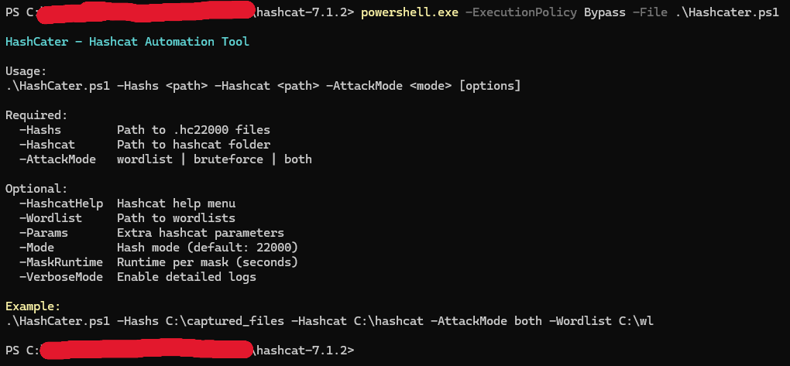
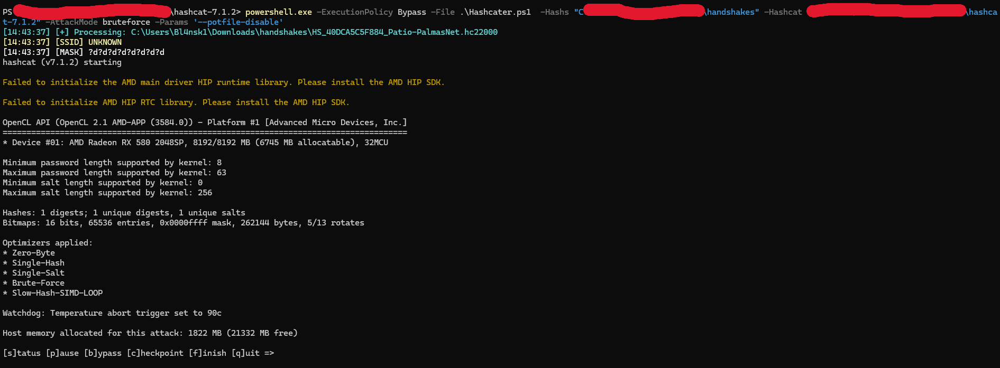
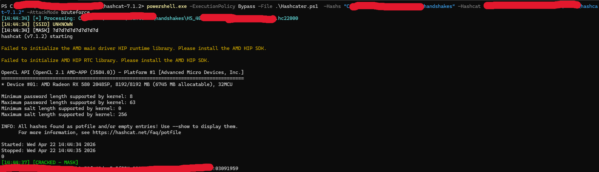

<p align="center">
  <b>Automated Hashcat Wrapper for WPA/WPA2 (.hc22000) Cracking</b><br>
  Fast, smart and practical password cracking automation
</p>
<p align="center">
  
  
  
  
</p>

---

## ⚡ Overview

**HashCater** is a lightweight automation wrapper for Hashcat focused on WPA/WPA2 (`.hc22000`) workflows.

It orchestrates attacks intelligently by combining:

- Wordlists  
- Brute-force masks  
- SSID-based heuristics  

All while minimizing manual interaction.

---

## 📸 Demo

### 🔹 Running HashCater



### 🔹 Attack Phase



### 🔹 Successful Crack



---

## 🚀 Features

- ⚡ Automated attack chaining (wordlist → masks → fallback)  
- 🧠 SSID-aware mask prioritization  
- 🔍 Automatic crack detection (`--show`)  
- ⏱️ Runtime-limited mask execution  
- 🛠️ Native Hashcat parameter passthrough  
- 📖 Built-in Hashcat help mode  
- 🧾 Verbose logging support  

---

## 📦 Installation

### Requirements

- Hashcat - https://hashcat.net/hashcat/
- PowerShell 5.1+ or PowerShell Core
- Handshakes captured and converted to hc22000   

```powershell
git clone https://github.com/yourusername/hashcater
cd hashcater
```

---

## 🛠️ Usage

```powershell
.\HashCater.ps1 -Hashs <path> -Hashcat <path> -AttackMode <mode> [options]
```

---

## ⚙️ Parameters

| Flag | Description |
|------|------------|
| `-Hashs` | Path to `.hc22000` files |
| `-Hashcat` | Path to Hashcat directory |
| `-AttackMode` | `wordlist`, `bruteforce`, `both` |
| `-Wordlist` | Path to wordlists |
| `-Params` | Extra Hashcat parameters |
| `-Mode` | Hash mode (default: `22000`) |
| `-MaskRuntime` | Runtime per mask (seconds) |
| `-VerboseMode` | Enable debug logs |
| `-HashcatHelp` | Show Hashcat help |

---

## 📚 Examples

### Basic usage

```powershell
.\HashCater.ps1 `
  -Hashs C:\captures `
  -Hashcat C:\hashcat `
  -AttackMode both `
  -Wordlist C:\wordlists
```

---

### Custom performance tuning

```powershell
.\HashCater.ps1 `
  -Hashs . `
  -Hashcat . `
  -AttackMode bruteforce `
  -Params "-w 4 -O --status"
```

---

### Show Hashcat help

```powershell
.\HashCater.ps1 -HashcatHelp -Hashcat C:\hashcat
```

---

## 🔄 Attack Flow

```
for each .hc22000:
    extract SSID
    run wordlist attack (if enabled)
    if cracked → stop
    run prioritized masks
    if cracked → stop
    fallback to numeric brute-force
```

---

## 🧠 Mask Strategy

### Default

```
?d?d?d?d?d?d?d?d
?d?d?d?d?d?d?d?d?d?d
?l?l?l?l?l?l?d?d
?l?l?l?l?d?d?d?d
```

### SSID-based

```
<ssid>?d?d
<ssid>?d?d?d
<ssid>?d?d?d?d
```

### ISP Heuristics

Prioritizes numeric masks for:

- VIVO  
- CLARO  
- TP-LINK  
- NET  
- WIFI  

---

## 🧾 Logging

```
[12:00:00] [+] Processing: file.hc22000
[12:00:01] [SSID] MyNetwork
[12:00:02] [WL] rockyou.txt
[12:00:10] [CRACKED - WL]
```

---

## 🎯 Design Philosophy

- Minimal interaction  
- Smart defaults  
- Efficient attack ordering  
- Compatibility with native Hashcat  

---

## 🗺️ Roadmap

- Hybrid attacks (`-a 6 / -a 7`)  
- Rule-based attacks (`best64`, `dive`)  
- GPU auto-tuning  
- Multi-GPU support  
- Integration with `hcxpcapngtool`  

---

## ⚠️ Disclaimer

This tool is intended for **authorized security testing only**.  
Do not use against networks without permission.

---

## 🤝 Credits

- Hashcat  
- WPA/WPA2 research community
- PSCat - https://github.com/DaDubbs/PSCat

---

## ⭐ Contributing

Pull requests, issues and ideas are welcome.
